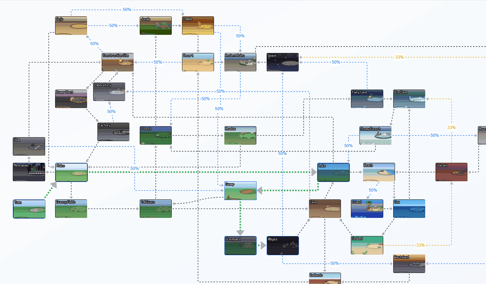

# Pokérogue Biomes



A simple map/pathfinder web-app for [https://pokerogue.net/](https://pokerogue.net/) biomes

Made with [Next.js](https://nextjs.org) 

## To run locally

Install npm, then:

```bash
npm run dev

```

Open [http://localhost:3000](http://localhost:3000)


## File layout

[`biome-route-finder.tsx`](/biome-route-finder.tsx) is the main component, used in [`/app/page.tsx`](/app/page.tsx)

The list of biomes and the adjacency list that stores info about edges/probabilties is in [`biome-data.ts`](/biome-data.ts),
although the information about the actual ReactFlow graph, such as node placement, edge endpoint placement, and edge type is in [`biome-graph.tsx`](/biome-graph.tsx).
